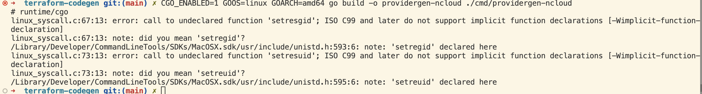
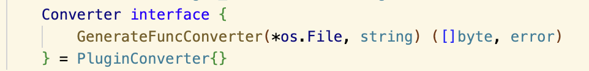
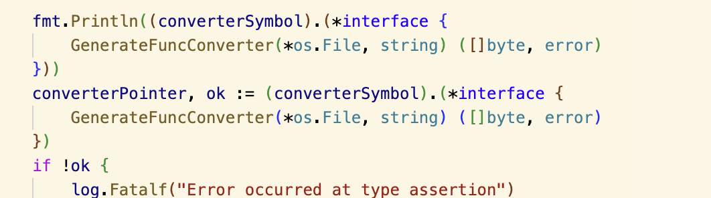

+++
title = '241030'
date = 2024-10-31T17:30:40+09:00
draft = false
+++

## Go plugin 사용하면서 에러 사항 정리

1. cgo로 빌드하지 않음
2. 리눅스로 빌드하지 않음
3. function을 바로 꺼내와서 사용을 시도하다 실패함 => 구조체 형태로 끌어올 수 있어야 함. (함수의 경우 타입 추론이 어려웠던 건가? => 사실 이것도 포인터로 반환되어서 그랬던 건가? 확인 필요함.)
4. 구조체로 끌어올 때에는 주소값을 가져오니까 에러가 안 나더라도 역참조를 필히 해주기.
5. cgo_enabled 설정 해주기.
6. spec을 정확히 입력해줄 필요가 있음. 오탈자 등을 허용하지 않음.
7. CGO_ENABLED 옵션을 주면서 크로스 컴파일하는 경우(맥에서 리눅스용 빌드), 에러가 뜸.

8. 같은 타입이라고 할지라도 pointer를 이용해서 주소값을 가져오는 경우에는 인터페이스가 같고 내부 구조가 동일하다고 해도 아예 다른 곳에서 선언되어 주소값이 다르다면 소용없다. 직접 flatten하게 타입을 명시해주어야한다.
   1. panic: interface conversion: plugin.Symbol is *util.Converter, not *util.Converter (types from different scopes)
   2. 기존에 plugin_spec.go에 SSOT로 인터페이스를 구현해두고, 이를 포인터로 가져오는 방식을 사용했주는데,
      1. Plugin 내부적으로 역참조한 최종 값 이외에 각 과정에서 거치는 주소값도 확인하는 듯 하다.

## 결론

plugin 좋은데, 다음 상황에서 써보자.

1. 서로 겹치는 패키지가 없음.
2. 만약 겹치는 패키지가 있다면, 서브 모듈화하여 동일한 go.mod를 공유할 수 있도록 하자.
