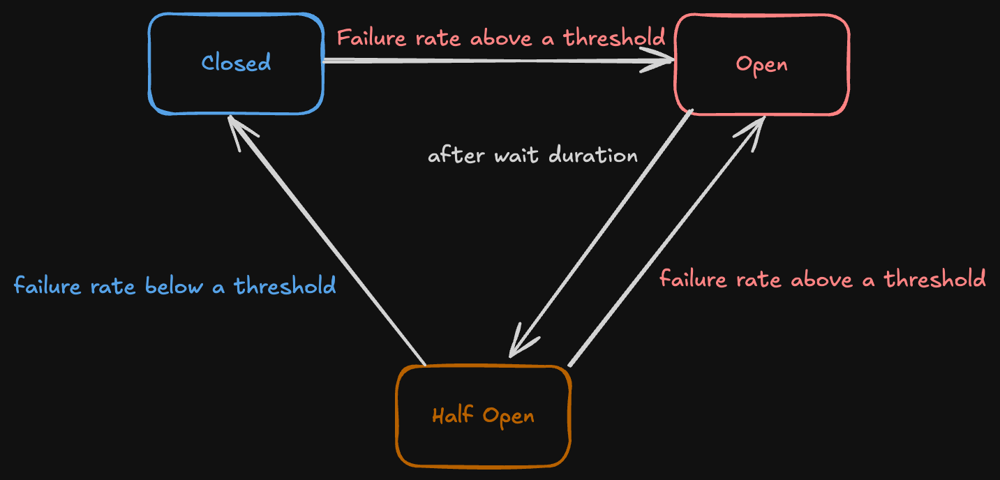

+++
title = '241104'
date = 2024-11-06T18:09:22+09:00
draft = true
+++

## Circuit Breaker

회로 차단기. 실제로 많이 사용되는 곳은 주식시장에서인 듯하다.
소프트웨어 관점에서는 회로 차단기의 컨셉을 그대로 가져온 경우에 해당하는 듯하다.

애플리케이션 간의 통신에서 한 쪽의 장애 발생을 다른 애플리케이션으로 전파하지 않고 격리하기 위한 수단으로 사용된다.

실제로는 애플리케이션 내부 최전선에 존재하는 얇은 레이어에 해당하며, 구현체는 내부 라이브러리 형태로 존재한다.

유명한 라이브러리로는 resilince4j 등이 존재한다.

---

실제 구현체를 살펴보면 생각보다 간단한 형태를 띄는데,

내부에는 3가지 상태를 가지는 FSM으로 존재한다.

`Open`: 서킷브레이커가 동작하여 요청을 차단하는 상태
`Closed`: 서킷브레이커가 동작하지 않고 요청을 받아들이는 상태
`HalfOpen`: 서킷브레이커가 다음 요청을 판별하여 다음 동작을 결정하기 위해 대기하는 상태

아래와 같이 동작한다.

`
